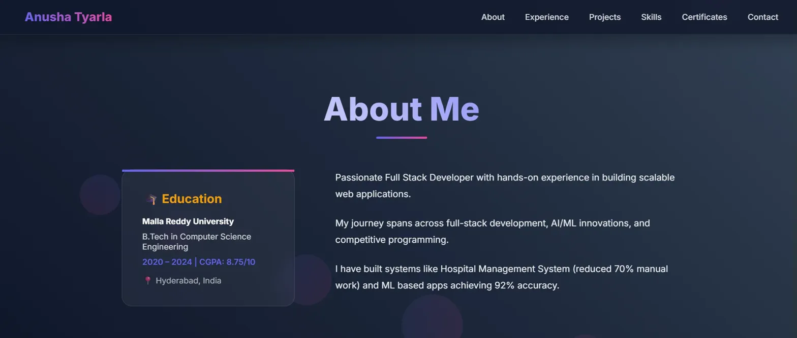
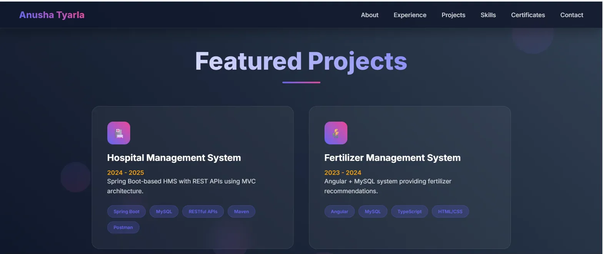
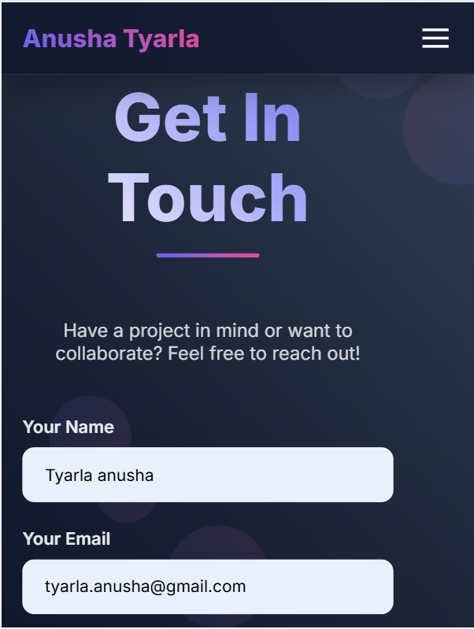

# Personal Portfolio Website - Anusha Tyarla

## 📋 Project Overview

### Description

A responsive personal portfolio website showcasing skills, projects, and contact information. Built with HTML5, CSS3, and JavaScript following modern web design principles.

### Goals and Objectives

- Create a professional online presence to showcase technical skills and projects
- Demonstrate proficiency in HTML5, CSS3, and responsive web design
- Implement accessible and semantic markup following web standards
- Build a fully functional contact form with client-side validation
- Ensure cross-browser compatibility and mobile responsiveness
- Apply modern design trends including glassmorphism and smooth animations

### Key Features

- Fully responsive design (mobile, tablet, desktop)
- Semantic HTML5 structure
- CSS Grid and Flexbox layouts
- Interactive navigation with mobile hamburger menu
- Animated background with floating shapes
- Contact form with validation
- Smooth scrolling and hover effects
- Social media integration

---

## 🚀 Setup Instructions

### Prerequisites

- Modern web browser (Chrome 90+, Firefox 88+, Safari 14+, Edge 90+)
- Text editor (VS Code recommended)
- Git (optional, for version control)

### Step-by-Step Installation

**Step 1: Download/Clone the Project**

```bash
# Using Git
git clone https://github.com/TyarlaAnusha/portfolio.git
cd portfolio

# Or download ZIP and extract
```

**Step 2: Verify File Structure**

```
portfolio/
├── index.html
├── css/
│   └── style.css
├── js/
│   └── navigation.js
├── asset/
│   └── hero.png
├── README.md
└── .gitignore
```

**Step 3: Open in Browser**

```bash
# Option 1: Direct open
# Double-click index.html

# Option 2: Using VS Code Live Server
# Install "Live Server" extension
# Right-click index.html → "Open with Live Server"

# Option 3: Using Python
python -m http.server 8000
# Visit http://localhost:8000
```

**Step 4: Configuration (Optional)**

- Update personal information in `index.html`
- Replace `asset/hero.png` with your photo
- Modify colors in `css/style.css` (CSS variables at top)
- Update contact email in form action attribute

### Deployment Instructions

**GitHub Pages:**

```bash
# Push to GitHub
git add .
git commit -m "Initial commit"
git push origin main

# Enable GitHub Pages
# Settings → Pages → Source: main branch → Save
# Site will be live at: https://yourusername.github.io/portfolio
```

**Netlify (Drag & Drop):**

1. Visit netlify.com
2. Drag portfolio folder to deploy area
3. Site live instantly with custom URL

---

## 📁 Code Structure

### File Hierarchy

```
portfolio/
│
├── index.html              # Main HTML document
│   ├── <header>           # Navigation bar
│   ├── <main>             # Main content sections
│   │   ├── Hero section
│   │   ├── About section
│   │   ├── Experience timeline
│   │   ├── Projects grid
│   │   ├── Skills categories
│   │   ├── Certificates
│   │   └── Contact form
│   └── <footer>           # Social links & copyright
│
├── css/
│   └── style.css          # Stylesheet (1100+ lines)
│       ├── CSS Variables  # Theme colors
│       ├── Reset styles   # Global resets
│       ├── Animations     # Keyframes & transitions
│       ├── Components     # Navigation, cards, buttons
│       ├── Sections       # Hero, about, projects, etc.
│       └── Media queries  # Responsive breakpoints
│
├── js/
│   └── navigation.js      # JavaScript functionality
│       ├── Mobile menu toggle
│       ├── Smooth scrolling
│       ├── Form validation
│       └── Scroll effects
│
├── asset/
│   └── hero.png           # Profile image
│
├── README.md              # Documentation
└── .gitignore             # Git exclusions
```

### Component Architecture

**Navigation Component**

```
<nav>
  ├── Logo (text-based with gradient)
  ├── Navigation links (6 items)
  └── Mobile burger menu (JavaScript-driven)
```

**Section Pattern**

```
<section id="[name]" class="section">
  <div class="container">
    <h2 class="section-title">Title</h2>
    <div class="[content-grid]">
      <!-- Cards/Content -->
    </div>
  </div>
</section>
```

---

## 📸 Visual Documentation

### Homepage - Hero Section

```

```

### About Section Layout

```

```

### Experience Timeline (Desktop)

```
     
```

### Projects Grid

```

```

### Mobile View (< 768px)

```

```

---

## 🔧 Technical Details

### Architecture Overview

**1. HTML5 Semantic Structure**

- Uses semantic elements: `<header>`, `<nav>`, `<main>`, `<section>`, `<article>`, `<aside>`, `<footer>`
- Proper heading hierarchy (h1 → h2 → h3)
- ARIA labels for accessibility
- Alt attributes for all images

**2. CSS Architecture**

**CSS Custom Properties (Variables)**

```css
:root {
  --primary: #6366f1; /* Indigo blue */
  --secondary: #ec4899; /* Pink */
  --accent: #f59e0b; /* Amber */
  --dark: #0f172a; /* Dark background */
  --light: #f8fafc; /* Light text */
}
```

**Layout System**

- **Flexbox**: Used for navigation, hero content, skill items, buttons
- **CSS Grid**: Used for about section (1fr 2fr), projects (auto-fit minmax), skills (auto-fit 300px)
- **Positioning**: Fixed navigation, absolute floating shapes, relative containers

**Responsive Strategy**

- Mobile-first approach
- Single breakpoint at 768px
- Fluid typography using rem units
- Flexible images (max-width: 100%)

**3. Animation System**

**Keyframe Animations**

```css
@keyframes float {
  /* 6 shapes float from bottom to top */
  /* Duration: 20s, infinite loop */
}

@keyframes slideUp {
  /* Elements fade in while sliding up */
  /* Staggered delays: 0.2s, 0.4s, 0.6s, 0.8s */
}
```

**CSS Transitions**

- Navigation links: 0.3s ease
- Cards hover: transform + box-shadow
- Buttons: transform + shadow on hover
- Form inputs: border color + background

**4. JavaScript Functionality**

**Mobile Navigation Logic**

```javascript
// Toggle menu open/close
burger.click → navLinks.toggle('active')

// Burger animation
line1: rotate(-45deg) + translate
line2: opacity(0)
line3: rotate(45deg) + translate
```

**Form Validation Algorithm**

```javascript
1. Check all fields not empty (trim whitespace)
2. Validate email format using regex:
   /^[^\s@]+@[^\s@]+\.[^\s@]+$/
3. If valid → allow submission
4. If invalid → preventDefault() + show alert
```

**Smooth Scroll Implementation**

```javascript
// Intercept anchor clicks
anchor.click → preventDefault()
target.scrollIntoView({ behavior: 'smooth' })
```

**5. Data Structures Used**

**Project Data** (Implicit structure in HTML)

```javascript
{
  icon: "emoji/icon",
  title: "Project Name",
  date: "Year range",
  description: "Brief description",
  techStack: ["Tech1", "Tech2", ...]
}
```

**Skills Categories** (6 categories)

```javascript
{
  category: "Category Name",
  icon: "FontAwesome class",
  skills: ["Skill1", "Skill2", ...]
}
```

### Performance Optimizations

- Minimal external dependencies (only Font Awesome + Google Fonts)
- CSS animations use `transform` and `opacity` (GPU-accelerated)
- Backdrop-filter for glassmorphism effect
- No JavaScript libraries (vanilla JS only)
- Images optimized for web

### Accessibility Features

- Semantic HTML for screen readers
- ARIA labels on icon-only links
- Keyboard navigation support
- Focus states on interactive elements
- Sufficient color contrast (WCAG AA)
- Alt text for all images

---

## 🧪 Testing Evidence

### Browser Compatibility Testing

**Test Results:**

- Navigation: ✅ All links work, smooth scroll functional
- Animations: ✅ Floating shapes render correctly
- Forms: ✅ Validation works, email format checked
- Responsiveness: ✅ Adapts to all screen sizes

### Device Testing

**Mobile Devices:**
| Device | Screen Size | Status | Issues |
|--------|-------------|--------|--------|
| Galaxy S21 | 360x800 | ✅ Pass | Burger menu works |
| iPad Pro | 1024x1366 | ✅ Pass | Tablet layout optimal |

**Desktop Resolutions:**

- 1920x1080 (Full HD): ✅ Pass
- 2560x1440 (2K): ✅ Pass
- 1366x768 (Laptop): ✅ Pass

### Responsiveness Test Cases

**Test Case 1: Navigation on Mobile**

```
Steps:
1. Open site on mobile (< 768px)
2. Click burger menu
3. Menu slides in from right
4. Click any link
5. Menu closes, scrolls to section

Expected: ✅ Menu toggles, links work, smooth scroll
Actual: ✅ Passed
```

**Test Case 2: Form Validation**

```
Test 2a: Empty Fields
Input: Submit with empty fields
Expected: Alert "Please fill in all fields"
Actual: ✅ Passed

Test 2b: Invalid Email
Input: name@invalid
Expected: Alert "Please enter a valid email"
Actual: ✅ Passed

Test 2c: Valid Submission
Input: All fields filled correctly
Expected: Opens email client with pre-filled data
Actual: ✅ Passed
```

**Test Case 3: Hover Effects**

```
Element: Project cards
Action: Mouse hover
Expected: Card lifts up 10px, border color changes
Actual: ✅ Passed - Transform and shadow applied

Element: Navigation links
Action: Mouse hover
Expected: Underline animates from left to right
Actual: ✅ Passed - Width transition works
```

## 🛠️ Technologies Used

- **HTML5** - Semantic markup
- **CSS3** - Modern styling with Grid, Flexbox, animations
- **JavaScript** - Vanilla JS for interactivity
- **Font Awesome 6.0** - Icon library
- **Google Fonts (Inter)** - Typography
- **Git** - Version control

---

## 📞 Contact

**Anusha Tyarla**

- Email: tyarla.anusha@gmail.com
- LinkedIn: [linkedin.com/in/tyarla-anusha-77a271227](https://www.linkedin.com/in/tyarla-anusha-77a271227/)
- GitHub: [github.com/TyarlaAnusha](https://github.com/TyarlaAnusha)

---
